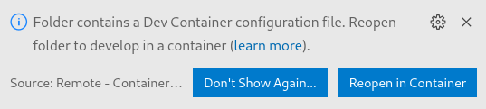
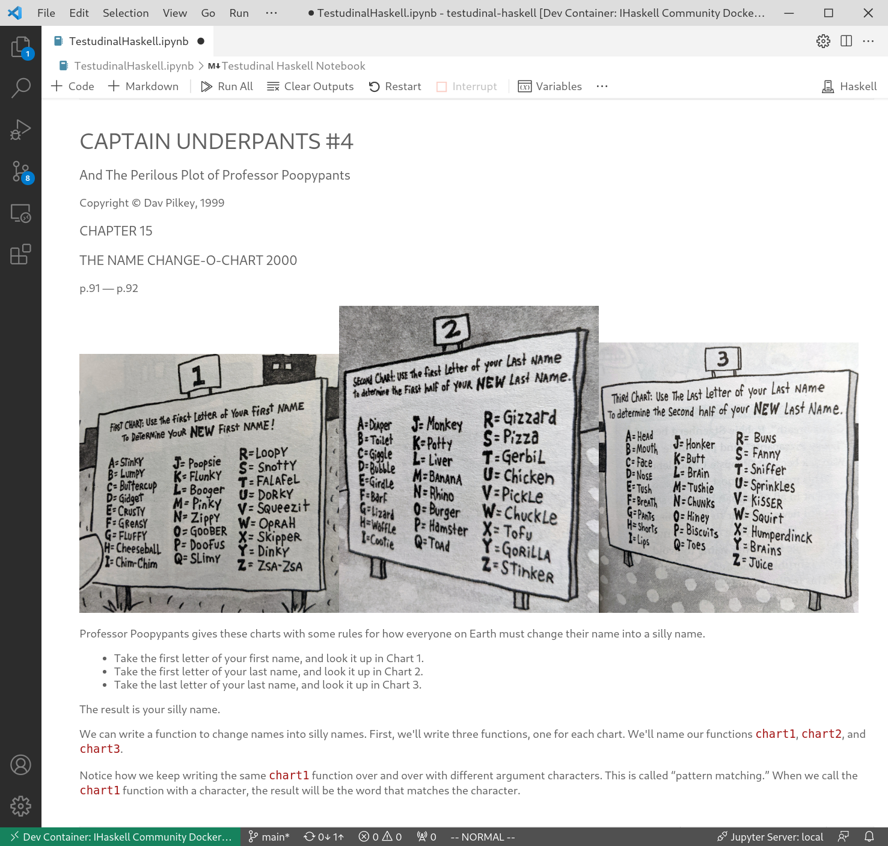
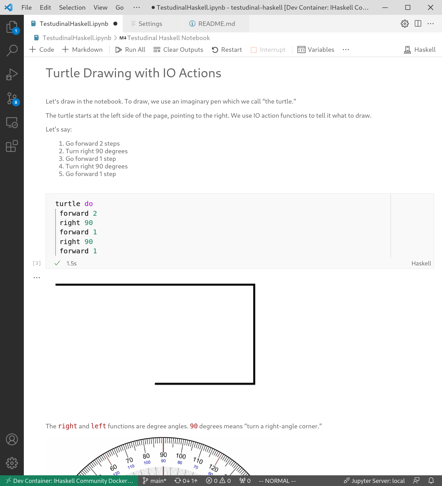
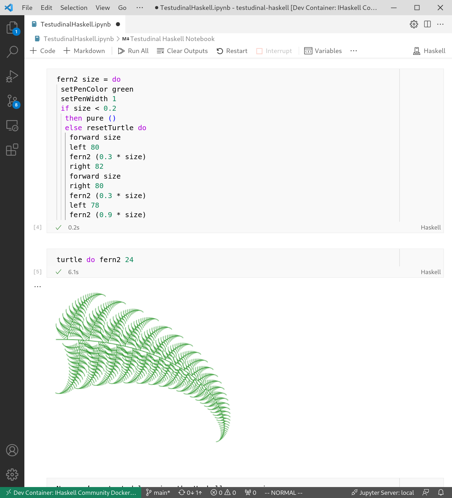

# Testudinal Haskell

Haskell programming with turtle graphics, for ages 9–13.

This is an attempt to provide a real Haskell educational programming
environment for the youngest possible audience.
It’s a Jupyter notebook REPL running Haskell in Visual Studio Code.

# Requirements

Docker and Visual Studio Code must be installed on your system.

This will have to be done by someone who knows how
to install and configure software development tools.

## Docker

You must have Docker installed and running on your system.

https://docs.docker.com/get-docker/

## Visual Studio Code

Jupyter support is improving rapidly. You should be on the latest version,
at least August 2021.

### Extensions

* Jupyter __ms-toolsai.jupyter@2021.8.2041215044__ (later versions are buggy at the time of this writing)
* Haskell Syntax Highlighting __justusadam.language-haskell__
* Remote - Containers __ms-vscode-remote.remote-containers__

This commandline will install the extensions for you.

```
code --install-extension ms-toolsai.jupyter@2021.8.2041215044 && code --install-extension justusadam.language-haskell && code --install-extension ms-vscode-remote.remote-containers
```

# Running

## Method 1

```
git clone https://github.com/jamesdbrock/testudinal-haskell.git
cd testudinal-haskell
code .
```

Then make sure you click the popup __Reopen in Container__ button to run the devcontainer.

]

## Method 2

To run VS Code directly in the devcontainer, you’ll have to first follow
these instructions.

[Opening a folder directly within a dev container](https://code.visualstudio.com/docs/remote/devcontainer-cli#_opening-a-folder-directly-within-a-dev-container)

```
cd testudinal-haskell
devcontainer open .
```

## Disable VS Code extensions

Remember to turn off your Vim keybindings for children.

```
code --disable-extension vscodevim.vim .
```


# Ingredients

These are the essential ingredients, some of which
have only become available in 2021, that I think make a very nice Haskell programming
environment for children.

* [Jupyter Notebooks in VS Code](https://code.visualstudio.com/docs/datascience/jupyter-notebooks)

  Browser-based Jupyter is actually pretty dreadful. If you know where to click it works okay,
  but if you are just experimentally clicking around the window and pressing buttons
  then you will very soon activate some browser function that takes you away from the page
  that you're on, which is very confusing.

* [VS Code devcontainers](https://github.com/microsoft/vscode-dev-containers)

  A Jupyter client with an IHaskell kernel and all of the necessary libraries
  is a massively polyglot multiprocess software system. A container is a pretty
  ideal way to package and distribute this system. The fact that VS Code can
  run a Jupyter kernel out of a container is very convenient.

* [Diagrams.TwoD.Path.Turtle](https://hackage.haskell.org/package/diagrams-contrib/docs/Diagrams-TwoD-Path-Turtle.html)

  The turtle drawing library for the
  [__diagrams__](https://archives.haskell.org/projects.haskell.org/diagrams/)
  package.

* [IHaskell Widgets](https://github.com/gibiansky/IHaskell/tree/master/ihaskell-display/ihaskell-widgets)

  Thanks David Davó for [reviving __ihaskell-widgets__](https://gsoc21.ddavo.me/)
  for the
  [IHaskell](https://github.com/gibiansky/IHaskell)
  Jupyter kernel.

* `default (Rational)` and `instance {-# OVERLAPPING  #-} Show (Rational)`

  All numbers are `Rational` by
  [default](https://www.haskell.org/tutorial/numbers.html#sect10.4)
  in the notebook.
  When a `Rational` is shown, we show it with the `/` operator instead of the
  `%` constructor.
  Anyone who has studied fractions will expect numbers to work this way,
  and rightly so. It's cruel to inflict IEEE 754 on children.

* [`LANGUAGE BlockArguments`](https://downloads.haskell.org/~ghc/latest/docs/html/users_guide/exts/block_arguments.html)

  Experienced Haskellers just write `$ do` without thinking about it, and
  they mostly don't notice how crazy and inexplicable that dollar sign is.
  [Thanks](https://gitlab.haskell.org/ghc/ghc/-/issues/10843),
  [Akio Takano](https://ghc-proposals.readthedocs.io/en/latest/proposals/0090-block-arguments.html).

# Screenshots







# Other Haskell Programming Education Resources

[Codeworld](https://code.world/) by [Chris Smith](https://github.com/cdsmith)

[Codeworld Haskell](https://code.world/haskell) More Haskelly Codeworld

[Try Haskell](https://tryhaskell.org/)

[*Learn You a Haskell for Great Good!* Jupyter adaptation](https://github.com/jamesdbrock/learn-you-a-haskell-notebook)

# Caveats

Here are some things which need improvement.

1. Error messages.

   They’re terrible. We try to pretend that Haskell is a simple language with
   no type annotations but when a type error occurs it’s nonsense
   to a ten-year-old.

